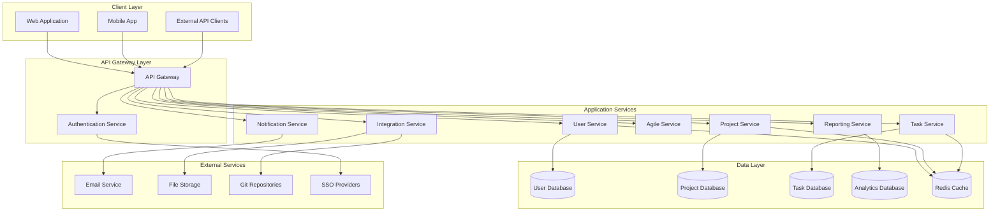

# Design Document

## Overview

The MAR ABU PROJECTS SERVICES LTD Project and Task Management Application is designed as a modern, scalable, enterprise-grade system following microservices architecture principles. The system will be built using a cloud-native approach with containerized services, event-driven communication, and a responsive web frontend with mobile support.

The application follows Domain-Driven Design (DDD) principles, organizing functionality around business domains: User Management, Project Management, Task Management, Agile/Scrum, Reporting, and Integration services.

## Architecture

### High-Level Architecture



### Technology Stack

**Frontend:**
- React.js with TypeScript for web application
- React Native for mobile applications
- Material-UI/Ant Design for component library
- Redux Toolkit for state management
- React Query for server state management

**Backend:**
- Node.js with Express.js/Fastify for API services
- TypeScript for type safety
- PostgreSQL for primary data storage
- Redis for caching and session management
- MongoDB for analytics and reporting data

**Infrastructure:**
- Docker containers for service deployment
- Kubernetes for orchestration
- NGINX for load balancing and reverse proxy
- Elasticsearch for search and logging
- RabbitMQ/Apache Kafka for event streaming

**Security:**
- JWT tokens for authentication
- OAuth 2.0/SAML for SSO integration
- bcrypt for password hashing
- HTTPS/TLS for data encryption

## Components and Interfaces

### Core Domain Models

#### User Management Domain

```typescript
interface User {
  id: string;
  email: string;
  firstName: string;
  lastName: string;
  role: UserRole;
  permissions: Permission[];
  isActive: boolean;
  lastLoginAt: Date;
  createdAt: Date;
  updatedAt: Date;
}

enum UserRole {
  ADMIN = 'admin',
  PROJECT_MANAGER = 'project_manager',
  TEAM_LEAD = 'team_lead',
  DEVELOPER = 'developer',
  VIEWER = 'viewer'
}

interface Permission {
  resource: string;
  actions: string[];
}
```

#### Project Management Domain

```typescript
interface Project {
  id: string;
  name: string;
  description: string;
  key: string; // Unique project identifier (e.g., "MAR-001")
  methodology: ProjectMethodology;
  status: ProjectStatus;
  startDate: Date;
  endDate: Date;
  budget: number;
  priority: Priority;
  ownerId: string;
  teamMembers: ProjectMember[];
  workflows: Workflow[];
  customFields: CustomField[];
  createdAt: Date;
  updatedAt: Date;
}

enum ProjectMethodology {
  AGILE = 'agile',
  WATERFALL = 'waterfall',
  KANBAN = 'kanban',
  HYBRID = 'hybrid'
}

interface ProjectMember {
  userId: string;
  role: ProjectRole;
  permissions: string[];
  joinedAt: Date;
}

interface Workflow {
  id: string;
  name: string;
  statuses: WorkflowStatus[];
  transitions: WorkflowTransition[];
}
```

#### Task Management Domain

```typescript
interface Task {
  id: string;
  key: string; // e.g., "MAR-123"
  title: string;
  description: string;
  type: TaskType;
  status: string;
  priority: Priority;
  assigneeId: string;
  reporterId: string;
  projectId: string;
  parentId?: string; // For subtasks
  estimatedHours: number;
  remainingHours: number;
  loggedHours: number;
  dueDate: Date;
  labels: string[];
  components: string[];
  dependencies: TaskDependency[];
  attachments: Attachment[];
  comments: Comment[];
  customFields: Record<string, any>;
  createdAt: Date;
  updatedAt: Date;
}

enum TaskType {
  STORY = 'story',
  BUG = 'bug',
  EPIC = 'epic',
  SUBTASK = 'subtask',
  TASK = 'task'
}

interface TaskDependency {
  dependentTaskId: string;
  type: DependencyType;
}

enum DependencyType {
  BLOCKS = 'blocks',
  IS_BLOCKED_BY = 'is_blocked_by',
  RELATES_TO = 'relates_to'
}
```

#### Agile/Scrum Domain

```typescript
interface Sprint {
  id: string;
  name: string;
  goal: string;
  projectId: string;
  startDate: Date;
  endDate: Date;
  status: SprintStatus;
  capacity: number;
  tasks: string[]; // Task IDs
  velocity: number;
  burndownData: BurndownPoint[];
  createdAt: Date;
  updatedAt: Date;
}

interface Backlog {
  id: string;
  projectId: string;
  items: BacklogItem[];
  priorityOrder: string[];
}

interface BacklogItem {
  taskId: string;
  storyPoints: number;
  priority: number;
  epic?: string;
}
```

### Service Interfaces

#### User Service

```typescript
interface IUserService {
  authenticate(credentials: LoginCredentials): Promise<AuthResult>;
  createUser(userData: CreateUserRequest): Promise<User>;
  updateUser(userId: string, updates: UpdateUserRequest): Promise<User>;
  getUserById(userId: string): Promise<User>;
  getUsersByRole(role: UserRole): Promise<User[]>;
  deactivateUser(userId: string): Promise<void>;
  assignPermissions(userId: string, permissions: Permission[]): Promise<void>;
}
```

#### Project Service

```typescript
interface IProjectService {
  createProject(projectData: CreateProjectRequest): Promise<Project>;
  updateProject(projectId: string, updates: UpdateProjectRequest): Promise<Project>;
  getProject(projectId: string): Promise<Project>;
  getProjectsByUser(userId: string): Promise<Project[]>;
  addTeamMember(projectId: string, member: ProjectMember): Promise<void>;
  removeTeamMember(projectId: string, userId: string): Promise<void>;
  createWorkflow(projectId: string, workflow: Workflow): Promise<Workflow>;
  updateWorkflow(projectId: string, workflowId: string, updates: Partial<Workflow>): Promise<Workflow>;
}
```

#### Task Service

```typescript
interface ITaskService {
  createTask(taskData: CreateTaskRequest): Promise<Task>;
  updateTask(taskId: string, updates: UpdateTaskRequest): Promise<Task>;
  getTask(taskId: string): Promise<Task>;
  getTasksByProject(projectId: string, filters?: TaskFilters): Promise<Task[]>;
  assignTask(taskId: string, assigneeId: string): Promise<void>;
  addComment(taskId: string, comment: CreateCommentRequest): Promise<Comment>;
  logTime(taskId: string, timeEntry: TimeEntry): Promise<void>;
  createDependency(taskId: string, dependency: TaskDependency): Promise<void>;
  transitionTask(taskId: string, newStatus: string): Promise<void>;
}
```

### API Endpoints

#### Authentication Endpoints
- `POST /api/auth/login` - User authentication
- `POST /api/auth/logout` - User logout
- `POST /api/auth/refresh` - Refresh JWT token
- `POST /api/auth/forgot-password` - Password reset request
- `POST /api/auth/reset-password` - Password reset confirmation

#### User Management Endpoints
- `GET /api/users` - List users with pagination and filters
- `POST /api/users` - Create new user
- `GET /api/users/:id` - Get user details
- `PUT /api/users/:id` - Update user
- `DELETE /api/users/:id` - Deactivate user
- `PUT /api/users/:id/permissions` - Update user permissions

#### Project Management Endpoints
- `GET /api/projects` - List projects
- `POST /api/projects` - Create project
- `GET /api/projects/:id` - Get project details
- `PUT /api/projects/:id` - Update project
- `DELETE /api/projects/:id` - Archive project
- `POST /api/projects/:id/members` - Add team member
- `DELETE /api/projects/:id/members/:userId` - Remove team member

#### Task Management Endpoints
- `GET /api/tasks` - List tasks with filters
- `POST /api/tasks` - Create task
- `GET /api/tasks/:id` - Get task details
- `PUT /api/tasks/:id` - Update task
- `DELETE /api/tasks/:id` - Delete task
- `POST /api/tasks/:id/comments` - Add comment
- `POST /api/tasks/:id/time` - Log time
- `PUT /api/tasks/:id/assign` - Assign task

## Data Models

### Database Schema Design

#### Users Table
```sql
CREATE TABLE users (
    id UUID PRIMARY KEY DEFAULT gen_random_uuid(),
    email VARCHAR(255) UNIQUE NOT NULL,
    password_hash VARCHAR(255) NOT NULL,
    first_name VARCHAR(100) NOT NULL,
    last_name VARCHAR(100) NOT NULL,
    role VARCHAR(50) NOT NULL,
    is_active BOOLEAN DEFAULT true,
    last_login_at TIMESTAMP,
    created_at TIMESTAMP DEFAULT CURRENT_TIMESTAMP,
    updated_at TIMESTAMP DEFAULT CURRENT_TIMESTAMP
);
```

#### Projects Table
```sql
CREATE TABLE projects (
    id UUID PRIMARY KEY DEFAULT gen_random_uuid(),
    name VARCHAR(255) NOT NULL,
    description TEXT,
    key VARCHAR(20) UNIQUE NOT NULL,
    methodology VARCHAR(50) NOT NULL,
    status VARCHAR(50) NOT NULL,
    start_date DATE,
    end_date DATE,
    budget DECIMAL(12,2),
    priority VARCHAR(20),
    owner_id UUID REFERENCES users(id),
    created_at TIMESTAMP DEFAULT CURRENT_TIMESTAMP,
    updated_at TIMESTAMP DEFAULT CURRENT_TIMESTAMP
);
```

#### Tasks Table
```sql
CREATE TABLE tasks (
    id UUID PRIMARY KEY DEFAULT gen_random_uuid(),
    key VARCHAR(50) UNIQUE NOT NULL,
    title VARCHAR(500) NOT NULL,
    description TEXT,
    type VARCHAR(50) NOT NULL,
    status VARCHAR(100) NOT NULL,
    priority VARCHAR(20),
    assignee_id UUID REFERENCES users(id),
    reporter_id UUID REFERENCES users(id),
    project_id UUID REFERENCES projects(id),
    parent_id UUID REFERENCES tasks(id),
    estimated_hours DECIMAL(8,2),
    remaining_hours DECIMAL(8,2),
    logged_hours DECIMAL(8,2) DEFAULT 0,
    due_date TIMESTAMP,
    created_at TIMESTAMP DEFAULT CURRENT_TIMESTAMP,
    updated_at TIMESTAMP DEFAULT CURRENT_TIMESTAMP
);
```

### Caching Strategy

**Redis Cache Structure:**
- User sessions: `session:{sessionId}`
- User permissions: `permissions:{userId}`
- Project metadata: `project:{projectId}`
- Task counters: `counters:project:{projectId}`
- Dashboard data: `dashboard:{userId}:{timeframe}`

**Cache TTL Policies:**
- User sessions: 24 hours
- Permissions: 1 hour
- Project metadata: 30 minutes
- Dashboard data: 15 minutes

## Error Handling

### Error Response Format

```typescript
interface ErrorResponse {
  error: {
    code: string;
    message: string;
    details?: any;
    timestamp: string;
    requestId: string;
  };
}
```

### Error Categories

1. **Authentication Errors (401)**
   - Invalid credentials
   - Expired token
   - Missing authentication

2. **Authorization Errors (403)**
   - Insufficient permissions
   - Resource access denied

3. **Validation Errors (400)**
   - Invalid input data
   - Missing required fields
   - Business rule violations

4. **Not Found Errors (404)**
   - Resource not found
   - Invalid resource ID

5. **Conflict Errors (409)**
   - Duplicate resource
   - Concurrent modification

6. **Server Errors (500)**
   - Database connection issues
   - External service failures
   - Unexpected system errors

### Error Handling Strategy

- Centralized error handling middleware
- Structured logging with correlation IDs
- Graceful degradation for non-critical features
- Circuit breaker pattern for external services
- Retry mechanisms with exponential backoff

## Testing Strategy

### Testing Pyramid

1. **Unit Tests (70%)**
   - Service layer business logic
   - Utility functions
   - Data validation
   - Domain model methods

2. **Integration Tests (20%)**
   - API endpoint testing
   - Database operations
   - External service integrations
   - Message queue interactions

3. **End-to-End Tests (10%)**
   - Critical user journeys
   - Cross-service workflows
   - UI automation tests

### Testing Tools and Frameworks

- **Unit Testing:** Jest, Mocha
- **Integration Testing:** Supertest, Testcontainers
- **E2E Testing:** Cypress, Playwright
- **Load Testing:** Artillery, K6
- **API Testing:** Postman, Newman

### Test Data Management

- Database seeding for consistent test data
- Factory pattern for test object creation
- Isolated test environments
- Automated test data cleanup

### Performance Testing

- Load testing for concurrent users (1000+ users)
- Stress testing for peak loads
- Database query performance optimization
- API response time monitoring (< 200ms for critical endpoints)

## Security Considerations

### Authentication and Authorization

- JWT-based authentication with refresh tokens
- Role-based access control (RBAC)
- Multi-factor authentication support
- Session management and timeout policies

### Data Protection

- Encryption at rest using AES-256
- TLS 1.3 for data in transit
- Database connection encryption
- Sensitive data masking in logs

### Security Headers

- Content Security Policy (CSP)
- HTTP Strict Transport Security (HSTS)
- X-Frame-Options
- X-Content-Type-Options

### Audit and Compliance

- Comprehensive audit logging
- Data retention policies
- GDPR compliance features
- Regular security assessments

### Input Validation and Sanitization

- Server-side validation for all inputs
- SQL injection prevention
- XSS protection
- CSRF token validation

## Performance Optimization

### Database Optimization

- Proper indexing strategy
- Query optimization
- Connection pooling
- Read replicas for reporting

### Caching Strategy

- Multi-level caching (Redis, CDN)
- Cache invalidation strategies
- Cache warming for critical data

### API Performance

- Response compression (gzip)
- Pagination for large datasets
- GraphQL for flexible data fetching
- Rate limiting and throttling

### Frontend Optimization

- Code splitting and lazy loading
- Image optimization and CDN
- Service worker for offline support
- Progressive Web App (PWA) features

This design provides a solid foundation for building a robust, scalable project management system that meets all the specified requirements while following modern architectural patterns and best practices.